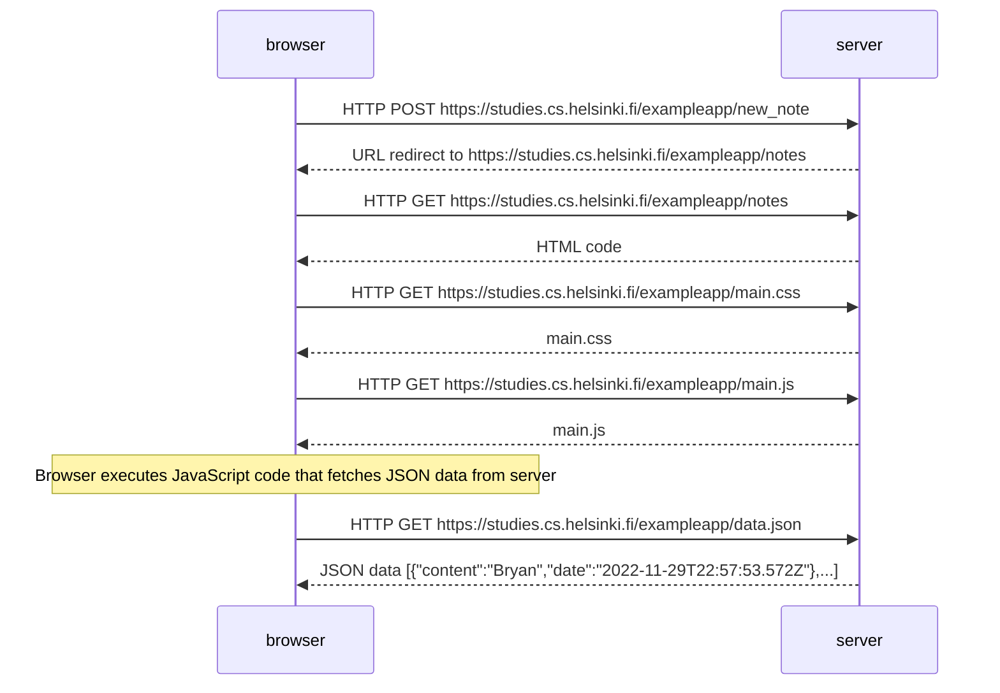
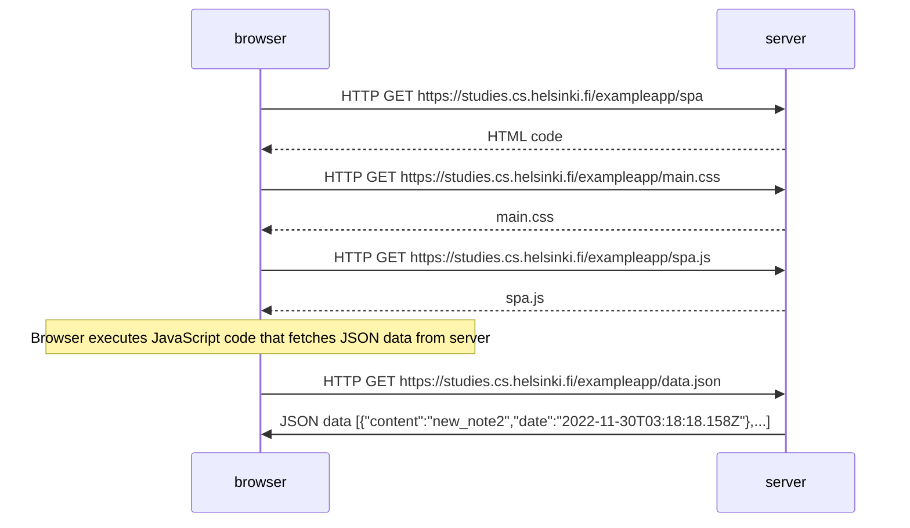

# 0.4: New note

```mermaid

sequenceDiagram
    browser->>server: HTTP POST https://studies.cs.helsinki.fi/exampleapp/new_note
    server-->>browser: URL redirect to https://studies.cs.helsinki.fi/exampleapp/notes
    browser->>server: HTTP GET https://studies.cs.helsinki.fi/exampleapp/notes
    server-->>browser: HTML code
    browser->>server: HTTP GET https://studies.cs.helsinki.fi/exampleapp/main.css
    server-->>browser: main.css
    browser->>server: HTTP GET https://studies.cs.helsinki.fi/exampleapp/main.js
    server-->>browser: main.js
    note over browser: Browser executes JavaScript code that fetches JSON data from server
    browser->>server: HTTP GET https://studies.cs.helsinki.fi/exampleapp/data.json
    server-->>browser: JSON data [{"content":"Bryan","date":"2022-11-29T22:57:53.572Z"},...]

```

# 0.5: Single page app

```mermaid

sequenceDiagram
    browser->>server: HTTP GET https://studies.cs.helsinki.fi/exampleapp/spa
    server-->>browser: HTML code
    browser->>server: HTTP GET https://studies.cs.helsinki.fi/exampleapp/main.css
    server-->>browser: main.css
    browser->>server: HTTP GET https://studies.cs.helsinki.fi/exampleapp/spa.js
    server-->>browser: spa.js
    note over browser: Browser executes JavaScript code that fetches JSON data from server
    browser->>server: HTTP GET https://studies.cs.helsinki.fi/exampleapp/data.json
    server->>browser: JSON data [{"content":"new_note2","date":"2022-11-30T03:18:18.158Z"},...]

```